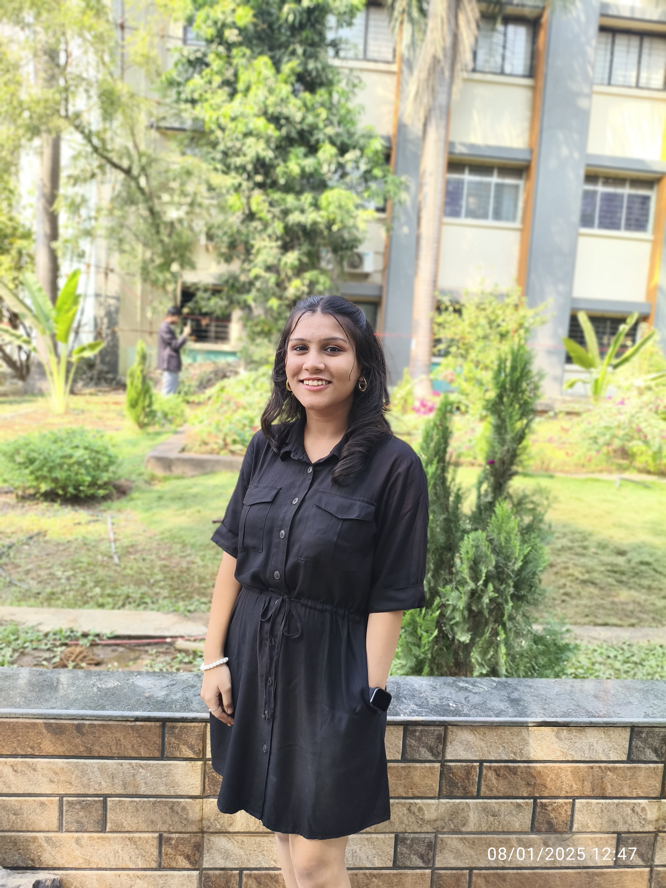

# Sharvari Bhondekar - Portfolio Website 🚀

<div align="center">
  
  
  [](https://sharvaribhondekarportfolio.vercel.app/)
  [](https://github.com/sharvarianand)
  [](https://www.linkedin.com/in/sharvari-bhondekar-872a7a282)
</div>

## 🌟 Overview

Welcome to my portfolio! I'm a **Software Engineer** specializing in building intelligent systems, scalable backends, and cinematic web experiences. This is a premium, high-performance portfolio built with **Next.js**, **TypeScript**, and **Framer Motion**, featuring a cinematic dark-mode aesthetic.

**Visit the live site: [sharvaribhondekarportfolio.vercel.app](https://sharvaribhondekarportfolio.vercel.app/)** 

## ✨ Key Projects

- **InterVueX AI:** AI-powered interview simulation platform with adaptive questioning and real-time evaluation.
- **CrowdKavach:** Real-time crowd intelligence system using AI-driven analysis for safety and anomaly detection.
- **Sentira:** Sentiment and contextual bias analysis platform using advanced NLP techniques.

## 🚀 Features

- **🌑 Cinematic Dark Mode:** Locked-in premium dark aesthetic for a professional, high-tech feel.
- **🎭 Advanced Animations:** Sequential name entrance, 3D rotating roles, and smooth scroll transitions using Framer Motion.
- **� Premium UI Components:**
  - Glassmorphic project cards with interactive glowing effects.
  - Neural Flow Field interactive background.
  - Interactive scroll-driven timeline for Education and Experience.
- **� Fully Responsive:** Optimized for everything from mobile devices to ultra-wide displays.
- **� SEO Optimized:** Integrated meta tags and semantic HTML for maximum search visibility.
- **📄 Interactive Resume:** Built-in PDF viewer with integrated monochromatic theme.

## 🛠️ Tech Stack

- **Framework:** [Next.js](https://nextjs.org/) (App Router)
- **Language:** [TypeScript](https://www.typescriptlang.org/)
- **Styling:** [Tailwind CSS](https://tailwindcss.com/)
- **Animations:** [Framer Motion](https://www.framer.com/motion/)
- **Interactive Elements:** [React Three Fiber](https://docs.pmnd.rs/react-three-fiber/), [Three.js](https://threejs.org/)
- **UI Architecture:** Custom-built components with [Lucide](https://lucide.dev/) and [Heroicons](https://heroicons.com/)

## 🚀 Getting Started

### Prerequisites
- Node.js (v20.x or later)
- npm

### Installation & Setup

1. **Clone the repository:**
   ```sh
   git clone https://github.com/sharvarianand/Portfolio.git
   cd Portfolio
   ```

2. **Install dependencies:**
   ```sh
   npm install
   ```

3. **Run the development server:**
   ```sh
   npm run dev
   ```

## 📁 Content Management

The portfolio is data-driven. To update content, simply edit the files in the `/data` directory:

- `data/projects.ts` - Showcase your latest work.
- `data/experience.ts` - Professional roles and research.
- `data/education.ts` - Academic background.
- `data/achievements.ts` - Hackathon wins and awards.
- `data/skills.ts` - Technical expertise.

## 📄 License

This project is licensed under the MIT License.

## 📫 Contact

- **Email:** [sharvaribhondekar23@gmail.com](mailto:sharvaribhondekar23@gmail.com)
- **LinkedIn:** [Sharvari Bhondekar](https://www.linkedin.com/in/sharvari-bhondekar-872a7a282)
- **GitHub:** [@sharvarianand](https://github.com/sharvarianand)

---

<div align="center">
  Building the future through AI and Scalable Engineering. ✨
</div>
